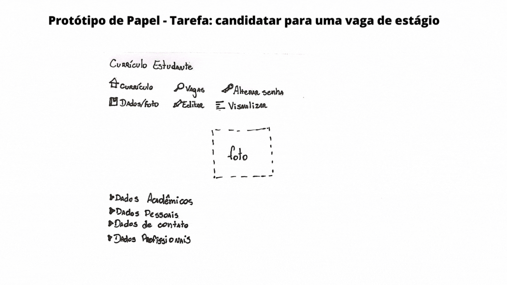
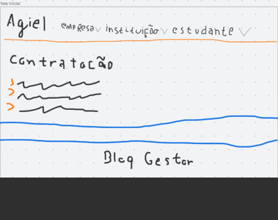

# ***Planejamento da Avaliação do Protótipo de Papel***

## **1. Introdução**

&emsp;&emsp;O <b>planejamento da avaliação do protótipo de papel</b> é essencial para garantir uma análise eficiente e eficaz do projeto em questão. A prototipação em papel é uma técnica amplamente adotada devido à sua <b>baixa complexidade e custo</b>, permitindo uma rápida <b>iteração e validação</b> de ideias. Neste processo, a equipe tem a oportunidade de coletar feedback valioso dos usuários, explorar novas soluções e realizar ajustes com facilidade. Este documento aborda o planejamento para a avaliação do protótipo de papel, visando otimizar a compreensão e aperfeiçoamento do projeto.

## **2. Metodologia**

&emsp;&emsp;Para o planejamento da avaliação do protótipo de papel, utilizaremos uma abordagem metodológica baseada no framework <b>DECIDE</b>. Esse framework é amplamente reconhecido na área de Interação Humano-Computador e fornece diretrizes para uma avaliação eficaz do protótipo. O DECIDE é composto pelos seguintes passos:

<ul>
<li> D - Determinar os objetivos gerais da avaliação e identificar a importância desses objetivos para o projeto e seus stakeholders;</li>
<li> E - Explorar as questões que desejamos responder por meio da avaliação do protótipo;</li>
<li> C - Escolher os métodos de avaliação mais adequados para atingir nossos objetivos;</li>
<li> I - Identificar e gerenciar as questões práticas relacionadas à avaliação, como recursos disponíveis e restrições de tempo;</li>
<li> D - Decidir como lidar com as questões éticas que possam surgir durante a avaliação;</li>
<li> E - Avaliar, interpretar e apresentar os dados coletados durante a avaliação do protótipo de papel.</li>
</ul>

&emsp;&emsp;Ao seguir essa metodologia, poderemos obter informações valiosas sobre a <b>eficácia e usabilidade</b> do protótipo, auxiliando na identificação de <b>melhorias</b> e no <b>aperfeiçoamento</b> do projeto.

## **3. DECIDE**
### **3.1 D - Definindo os objetivos da avaliação de usabilidade do site AGIEL**

&emsp;&emsp;A avaliação tem como objetivo principal confirmar a usabilidade do site AGIEL junto aos usuários e identificar problemas relacionados. Buscamos abordar:

<ul>
<li> Problemas de interação e design: Identificar dificuldades na navegação, elementos confusos e falta de clareza nas informações;</li>
<li> Conformidade com padrões: Verificar se o site atende às diretrizes de acessibilidade e boas práticas de design responsivo;</li>
<li> Ideias e alternativas de design: Coletar feedback para melhorias e possíveis alternativas de design que aprimorem a experiência dos usuários.</li>
</ul>

&emsp;&emsp;Com esses objetivos, buscamos garantir uma experiência de uso satisfatória e intuitiva para os usuários do site AGIEL.

### **3.2 E - Explorar perguntas a serem respondidas:**

&emsp;&emsp;As perguntas abaixo, na tabela 1, serão usadas durante a entrevista com o usuário.

| Nº |                                                                   Pergunta                                                                   |           Resposta           |
|:--:|:--------------------------------------------------------------------------------------------------------------------------------------------:|:----------------------------:|
| 1  |                             Você acha que os protótipos de papel apresentados são fáceis de entender e utilizar?                             |      [ ] Sim [ ] Não      |
| 2  |                              Qual dos protótipos de papel você acha mais intuitivo e amigável para os usuários?                              |     Número do protótipo      |
| 3  |                O que faz você considerar esse protótipo de papel mais fácil de entender e utilizar em comparação aos outros?                 |       Resposta aberta        |
| 4  |              Você identificou algum aspecto dos protótipos de papel que possa gerar confusão ou dificuldades para os usuários?               | Se sim, por favor, descreva. |
| 5  | Dos protótipos de papel apresentados, há algum que você acredita que precise de melhorias para facilitar a compreensão e uso pelos usuários? |     Número do protótipo      |
| 6  |                          Quais sugestões você teria para tornar esse protótipo de papel mais claro e fácil de usar?                          |       Resposta aberta        |

<h6 align = "center"> Tabela 1: Perguntas para entrevista
  Autor: Breno </h6>

### **3.3 C - Escolher (Choose) os métodos de avaliação:**

&emsp;&emsp;No planejamento da avaliação do protótipo de papel, decidimos utilizar <b>entrevistas</b> como método de coleta de dados. As entrevistas são uma abordagem qualitativa que nos permite obter <b>percepções valiosas</b> e <b>feedback direto</b> dos usuários. Essa escolha nos proporcionará uma compreensão aprofundada das experiências e opiniões dos usuários em relação ao protótipo de papel, permitindo-nos identificar <b>áreas de melhoria</b> e realizar <b>ajustes necessários</b> para aprimorar a usabilidade e a eficácia do projeto.

### **3.4 I - Identificar e administrar as questões práticas:**

&emsp;&emsp;No planejamento da avaliação do protótipo de papel, é crucial identificar e gerenciar as <b>questões práticas</b> relacionadas ao processo de coleta de dados e agendamento das entrevistas.

#### **Seleção e Recrutamento dos Participantes:**

&emsp;&emsp;Para garantir uma amostra representativa, definimos o perfil de usuário, buscando seguir o <a href='https://interacao-humano-computador.github.io/2023.1-Agiel/requisitos/perfil_do_usuario/#5-resultados'>Perfil de Usuário</a> previamente definido no projeto, adequado para participar da avaliação do protótipo de papel. Optamos por realizar o recrutamento de participantes procurando indivíduos que possuam características e necessidades semelhantes ao público-alvo do projeto. Dessa forma, obteremos insights valiosos e opiniões relevantes para a melhoria do protótipo.

#### **Agendamento das Entrevistas:**

&emsp;&emsp;Após selecionar os participantes, entramos em contato com cada um deles para agendar as entrevistas de forma individualizada. Levamos em consideração suas disponibilidades e preferências para garantir a participação de todos. Ao realizar o agendamento de forma cuidadosa, podemos facilitar a participação dos usuários e obter um conjunto diversificado de perspectivas sobre o protótipo de papel.

#### **Cronograma das Entrevistas**

&emsp;&emsp;A Tabela 2 registra o cronograma das entrevistas.

| Data  | Horário | Local  |         Atividade          | Entrevistador(es) | Entrevistado(s)  |
|:-----:|:-------:|:------:|:--------------------------:|:-----------------:|:----------------:|
| 29/05 |  19:30  | Remoto | Realização do teste piloto |       Breno       |  Bruno Camargos  |
| 29/05 |  20:00  | Remoto |  Realização da entrevista  |       Breno       | Danielle Barbosa |
| 29/05 |  20:00  | Remoto |  Realização da entrevista  |    Ana Beatriz    | Lívia Rodrigues  |
<h6 align = "center"> Tabela 2: Cronograma das entrevistas
  Autor: Ana Beatriz e Breno </h6>

### **3.5 D - Decidir como lidar com as questões éticas:**

&emsp;&emsp;Elaboramos um <a href='https://interacao-humano-computador.github.io/2023.1-Agiel/requisitos/aspectos_eticos/#2-termo-de-consentimento'>Termo de Consentimento</a>. Esse termo tem como objetivo garantir a proteção dos participantes e o cumprimento dos princípios éticos ao conduzir a avaliação.

#### **3.5.1 Termo de Consentimento**

&emsp;&emsp;Para a realização das entrevistas, os entrevistados devem ler e concordar com o seguinte termo de consentimento:

&emsp;&emsp;Somos o grupo 7 da disciplina Interação Humano-Computador, ministrada pelo professor André Barros, no curso de Engenharia de Software da Universidade de Brasília - Campus Gama.

&emsp;&emsp;Estamos realizando um projeto baseado no site do Agiel, cujo principal objetivo é avaliar e identificar os principais problemas na interface. Dessa forma, na etapa em que nos encontramos no projeto, estamos realizando avaliações sobre os storyboards que foram elaborados pelo grupo.

&emsp;&emsp;A entrevista será realizada de forma remota, com uma duração de aproximadamente 25 minutos. Para a realização da entrevista, o entrevistado deve estar ciente dos seguintes pontos:

<ul>
  <li>Os dados coletados na entrevista serão utilizados apenas para fins de estudo do grupo durante a disciplina</li>
  <li>O consentimento para a realização da entrevista é feito de forma livre, mediante esclarecimentos</li>
  <li>A sua privacidade será mantida. Utilizaremos somente as informações básicas como nome, idade, ocupação e grau de ensino</li>
  <li>O entrevistado tem total liberdade durante a entrevista, podendo interrompê-la a qualquer momento</li>
</ul>

&emsp;&emsp;Ao realizar essa entrevista, você estará auxiliando os integrantes do grupo a construir uma boa base de conhecimento e a desenvolver um projeto de qualidade para a disciplina.

&emsp;&emsp;Dessa forma, gostaríamos que você pronunciasse em alto e bom som:

<b>

&emsp;&emsp;Eu,[nome do entrevistado], aceito os termos e dou meu consentimento para a realização da entrevista.</b>

### **3.6 E - Avaliar (Evaluate), interpretar e apresentar os dados:**

&emsp;&emsp;Após coletar os dados, faremos uma análise cuidadosa para identificar padrões, tendências e insights relevantes que nos ajudarão a aprimorar o protótipo de papel. Os resultados serão interpretados e apresentados de forma clara e concisa, destacando os principais pontos para facilitar a compreensão. Essa etapa nos permitirá tomar decisões informadas e melhorar o projeto com base nos dados obtidos.

## **4. Protótipos de Papel Realizados**

&emsp;&emsp;Na figura 1, temos o protótipo de papel da tarefa de se candidatar para uma vaga de estágio.

<h6 align = "center"> Imagem 1: Protótipo de Papel - Canditadar a uma vaga de estágop.
  Autor: Ana Beatriz </h6>

&emsp;&emsp;Na figura 2, temos o protótipo de papel da tarefa de obter dicas sobre gestão de carreira.

<h6 align = "center"> Imagem 2: Protótipo de Papel - Obter dicas sobre gestão de carreira.
  Autor: Vitor Borges </h6>

&emsp;&emsp;Na figura 3, temos o protótipo de papel da tarefa de cadastrar uma instituição de ensino.

<h6 align = "center"> Imagem 3: Protótipo de Papel - Cadastrar uma instituição de ensino.
  Autor: Breno Yuri </h6>

&emsp;&emsp;Na figura 4, temos o protótipo de papel da tarefa de inscrever em um processo seletivo.

<h6 align = "center"> Imagem 4: Protótipo de Papel - Inscrever em um processo seletivo.
  Autor: Bruno Henrique </h6>

## **Histórico de Versão**

&emsp;&emsp;A Tabela 3 registra o histórico de versão desse documento.

| Versão | Data       | Descrição                                 | Autor(es)      | Revisor(es)    |
|--------|------------|-------------------------------------------|----------------|----------------|
| `1.0`  | 29/05/2023 | Criação do documento e adição do conteúdo | Breno Yuri     | Pedro Siqueira |
| `2.0`  | 03/07/2023 | Padronização do documento                 | Ana Beatriz    | Breno Yuri     |
| `2.1`  | 03/07/2023 | Prototipo papel processe seletivo         | Bruno Henrique | Ana Beatriz    |

<h6 align = "center"> Tabela 3: Histórico de Versão.
  Autor: Breno </h6>

## **Bibliografia**
> Barbosa, S. D. J., Silva, B. S. da, Silveira, M. S., Gasparini, I., Darin, T., & Barbosa, G. D. J. (2023). Interação Humano-Computador e Experiência do Usuário.*
