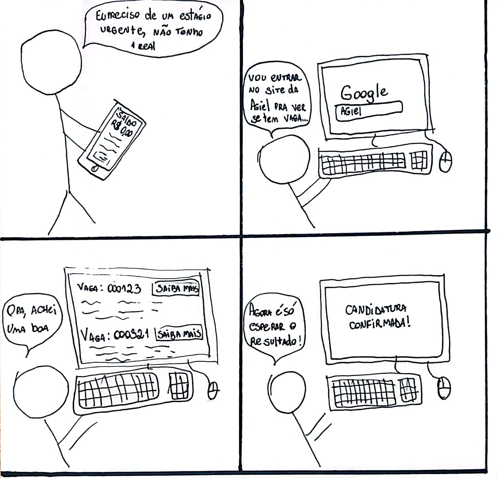
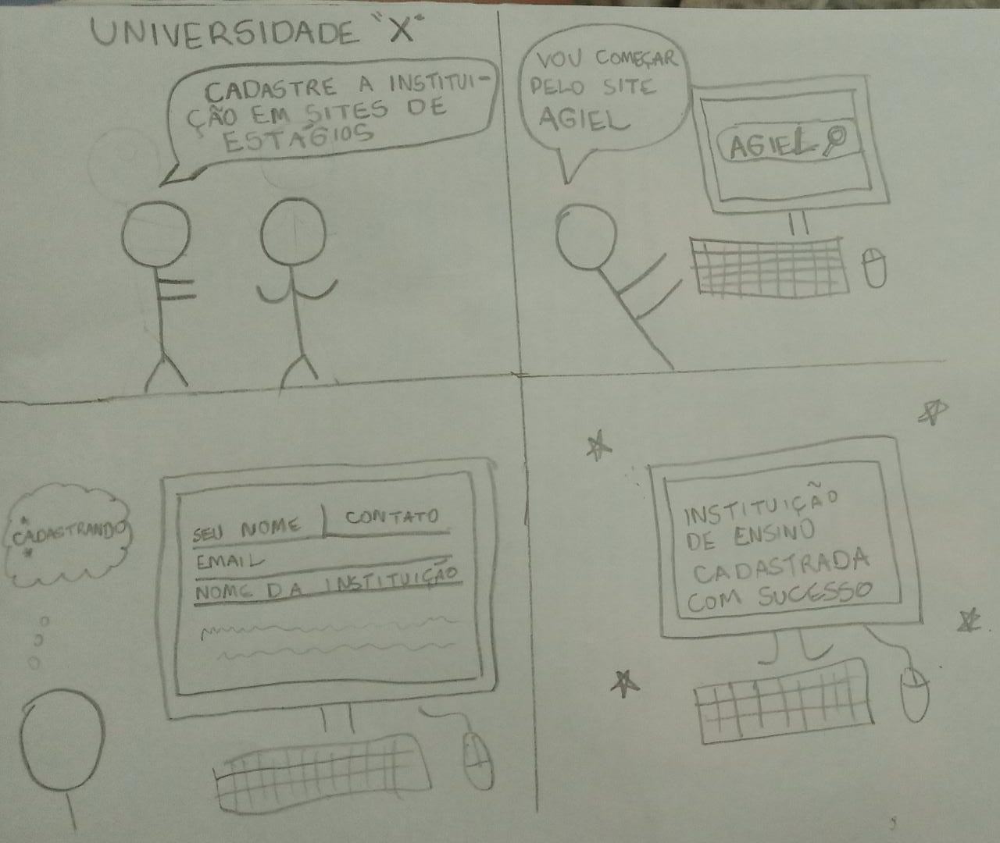
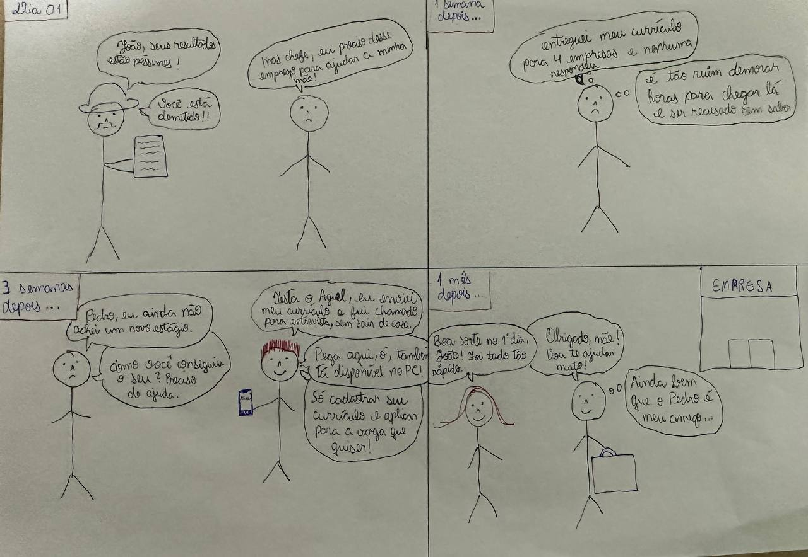
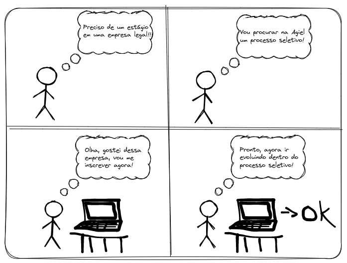
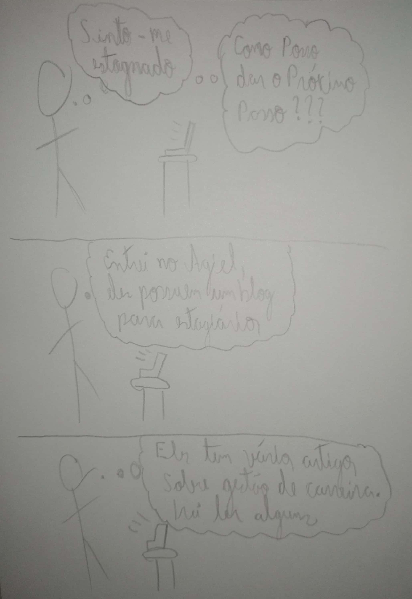
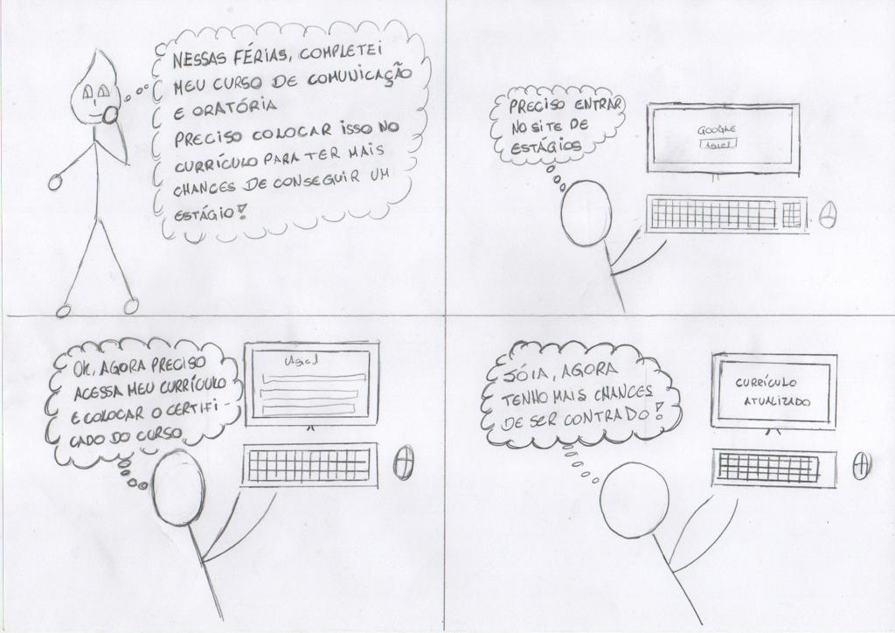

# Planejamento da avaliação - Storyboard

## 1. Introdução
Este documento apresenta o planejamento da avaliação do storyboard do site Agiel. O objetivo da avaliação é identificar possíveis melhorias no design e na usabilidade do storyboard, a fim de otimizar a experiência do usuário. A avaliação será conduzida utilizando a framework DECIDE, que oferece uma estrutura sistemática para a análise e avaliação de interfaces digitais.

## 2. Metodologia
A metodologia utilizada nesta avaliação seguirá a framework DECIDE, que é composta por seis etapas distintas:

- D - Determinar os objetivos da avaliação dos storyboards;
- E - Explorar perguntas a serem respondidas com a avaliação;
- C - Escolher (Choose) os métodos de avaliação a serem utilizados;
- I - Identificar e administrar as questões práticas da avaliação;
- D - Decidir como lidar com as questões éticas;
- E - Avaliar (Evaluate), interpretar e apresentar os dados.

## 3. Planejamento da Avaliação

### 3.1 D - Determinar os objetivos:
 - Identificar possíveis problemas de usabilidade no storyboard do site Agiel.
 - Propor melhorias para aprimorar a experiência do usuário.

### 3.2 E - Explorar perguntas a serem respondidas:

As perguntas abaixo, tabela 1, serão usadas durante a entrevista com o usuário.

| Nº |                                             Pergunta                                              |        Resposta         |
|:--:|:-------------------------------------------------------------------------------------------------:|:-----------------------:|
| 1  | No que se refere aos storyboards apresentados, você acha que todos eles condizem com a realidade? |   [ ] Sim [ ] Não    |
| 2  |            Qual dos storyboards apresentados você acha que não condiz com a realidade?            |  Número do storyboard   |
| 3  |                 Por quê você acha que este storyboard não condiz com a realidade?                 |     Resposta aberta     |
| 4  |    Você teria alguma sugestão de melhoria ou alteração em algum dos storyboards apresentados?     | [ ] Sim  [ ] Não  |
| 5  |         Qual dos storyboards apresentados você gostaria de contribuir com a sua opinião?          |  Número do storyboard   |
| 6  |               Qual sugestão de melhoria ou alteração você gostaria de compartilhar?               |     Resposta aberta     |
<h6 align = "center"> Tabela 1: Perguntas para entrevista
  Autor: Bruno  </h6>

### 3.3 C - Escolher (Choose) os métodos de avaliação:
No planejamento da avaliação do storyboard, optamos por utilizar entrevistas como método de coleta de dados. As entrevistas são uma técnica qualitativa que nos permite obter insights valiosos e feedback direto dos usuários.

### 3.4 I - Identificar e administrar as questões práticas:

#### 3.4.1 Seleção e recrutamento dos participantes: 
Para garantir uma amostra representativa, identificamos o perfil de usuários adequado e realizamos o recrutamento de amigos para as entrevistas.

#### 3.4.2 Agendamento das entrevistas: 
Entramos em contato com os participantes selecionados, agendando as entrevistas individualmente. Consideramos suas disponibilidades para garantir a participação de todos.

#### 3.4.3 Cronograma das entrevistas

A Tabela 2 registra o cronograma das entrevistas

| Data  | Horário | Local  |         Atividade          | Entrevistador(es) | Entrevistado(s)  |
|:-----:|:-------:|:------:|:--------------------------:|:-----------------:|:----------------:|
| 26/05 |  19:30  | Remoto | Realização do teste piloto |    Ana Beatriz    |      Bruno       |
| 26/05 |  20:00  | Remoto |  Realização da entrevista  |    Ana Beatriz    | Danielle Barbosa |
| 26/05 |  20:00  | Remoto |  Realização da entrevista  |       Bruno       |  Pedro Siqueira  |

<h6 align = "center"> Tabela 2: Cronograma das entrevistas
  Autor: Ana Beatriz e Bruno  </h6>

### 3.5 D - Decidir como lidar com as questões éticas:
Elaboramos um Termo de Consentimento. Esse termo tem como objetivo garantir a proteção dos participantes e o cumprimento dos princípios éticos ao conduzir a avaliação.

#### 3.5.1 Termo de Consentimento

Para a realização das entrevistas, os entrevistados devem ler e concordar com o seguinte termo de consentimento:

Somos o grupo 7 da disciplina Interação Humano-Computador, ministrada pelo professor André Barros, no curso de Engenharia de Software da Universidade de Brasília - Campus Gama.

Estamos realizando um projeto baseado no site do Agiel, cujo principal objetivo é avaliar e identificar os principais problemas na interface. Dessa forma, na etapa em que nos encontramos no projeto, estamos realizando avaliações sobre os storyboards que foram elaborados pelo grupo.

A entrevista será realizada de forma remota, com uma duração de aproximadamente 30 minutos. Para a realização da entrevista, o entrevistado deve estar ciente dos seguintes pontos:

<ul>
  <li>Os dados coletados na entrevista serão utilizados apenas para fins de estudo do grupo durante a disciplina</li>
  <li>O consentimento para a realização da entrevista é feito de forma livre, mediante esclarecimentos</li>
  <li>A sua privacidade será mantida. Utilizaremos somente as informações básicas como nome, idade, ocupação e grau de ensino</li>
  <li>O entrevistado tem total liberdade durante a entrevista, podendo interrompê-la a qualquer momento</li>
</ul>

Ao realizar essa entrevista, você estará auxiliando os integrantes do grupo a construir uma boa base de conhecimento e a desenvolver um projeto de qualidade para a disciplina.

Dessa forma, gostaríamos que você pronunciasse em alto e bom som:

<b>Eu, [nome do entrevistado], aceito os termos e dou meu consentimento para a realização da entrevista.</b>

### 3.6 E - Avaliar (Evaluate), interpretar e apresentar os dados:

Com base na análise dos dados, identificaremos padrões, tendências e insights relevantes para aprimorar o storyboard. Os resultados seram interpretados e organizados de forma clara e concisa, e uma apresentação dos principais pontos será preparada.

## 4. Storyboards Desenvolvidos
As imagens 1 - 5 são os storyboards feitos pela equipe.

<figcaption align="center">Imagem 1 - Storyboard Canditadar a uma vaga. Fonte: Ana Beatriz</figcaption>

<figcaption align="center">Imagem 2 - Storyboard Canditadar uma instituição de ensino. Fonte: Breno Yuri</figcaption>

<figcaption align="center">Imagem 3 - Storyboard Cadastrar currículo. Fonte: Pedro Siqueira</figcaption>

<figcaption align="center">Imagem 4 - Storyboard Inscrição em processo seletivo. Fonte: Bruno Henrique</figcaption>

<figcaption align="center">Imagem 5 - Storyboard Obter dicas sobre Gestão de carreira. Fonte: Vitor Borges</figcaption>

<figcaption align="center">Imagem 6 - Storyboard Atualização de currículo. Fonte: Carlos Daniel</figcaption>

## Histórico de Versão
A Tabela 3 registra o histórico de versão desse documento.

| Versão |    Data    |                  Descrição                   |  Autor(es)  | Revisor(es) |
|:------:|:----------:|:--------------------------------------------:|:-----------:|:-----------:|
| `1.0`  | 22/05/2023 |             Criação do documento             | Ana Beatriz |    Bruno    |
| `1.1`  | 22/05/2023 | Adição do termo de consentimento e perguntas |    Bruno    | Ana Beatriz |
| `1.2`  | 03/06/2023 | Adição de um novo storyboard |    Carlos   | Ana Beatriz |

<h6 align = "center"> Tabela 3: Histórico de Versões
  Autor: Ana Beatriz </h6>
