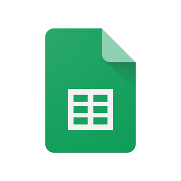

# 1. Introdução

Saber quais ferramentas utilizar pode agilizar o trabalho por torná-lo mais eficiente, automatizado, colaborativo e propenso ao aprendizado. Ferramentas colaborativas podem facilitar a colaboração em equipe e a aprendizagem sobre várias ferramentas pode tornar um indivíduo mais versátil e capaz de resolver diferentes tipos de problemas.

# 2. Ferramentas utilizadas

|                                            | Ferramenta      | Utilidade                                               |
|:------------------------------------------:|:---------------:|:-------------------------------------------------------:|
| | Google Sheets   | Criação de planilhas onde todos os membros podem editar |
|| Microsoft Teams | Realizar e gravar reuniões semanais                     |
|    | Telegram        | Troca de mensagens pontuais e realização de votações    |
|        | GitHub          | Versionamento do código e hospedagem da wiki            |
|       | VS Code         | Edição dos documentos                                   |

| Versão | Data  |            Descrição              |     Autor      |    Revisor    |
|:------:|:-----:|:---------------------------------:|:--------------:|:-------------:|
|  1.0   | 23/04 | Adição das ferramentas utilizadas | Vitor Borges   |               |