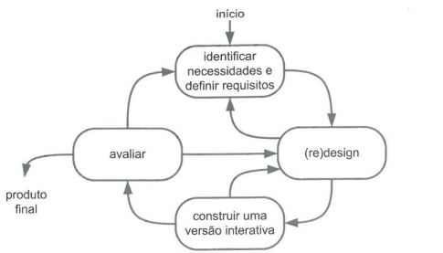
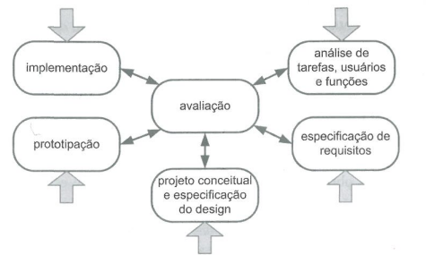
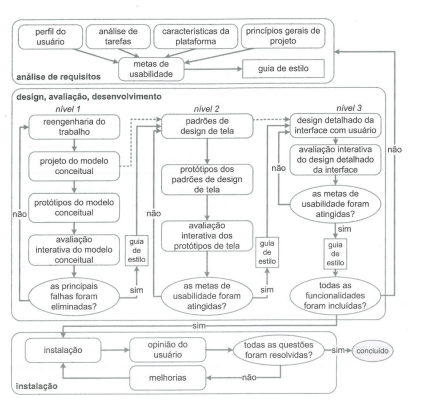

# ***Processo de Design***

## **1. Introdução**

&emsp;&emsp;O processo de design é fundamental para projetos de Interação Humano-Computador, <b>assegurando interfaces de alta usabilidade</b>. É importante considerar o usuário em todas as etapas do projeto, desde a <b>análise de requisitos</b> até a <b>implementação</b>, para proporcionar interações <b>eficientes</b> e <b>bem aceitas</b>.

## **2. Objetivos**

&emsp;&emsp;Este aterfato tem como objetivo determinar o <b>modelo de design</b> mais adequado ao projeto. Com este fim, certos critérios devem ser observados: <b>tempo</b>, <b>experiência da equipe</b>, <b>recursos disponíveis</b> e as <b>necessidades do projeto</b>.

## **3. Modelos de Design Avalidados**
### **3.1. Modelo Simples**

&emsp;&emsp;Preece, Sharp e Roges (Preece et al, 2002; Sharp et al, 2007) organizaram o modelo simples de design em IHC. Ele é composto por três etapas: <b>compreensão do contexto</b>, <b>projeto conceitual</b> e <b>prototipagem</b>.

<h6 align = "center">Figura 1: Ciclo de Vida Simples
  Autor: Carlos Daniel</h6>

&emsp;&emsp;Esse modelo, por sua simplicidade, é indicado para designers experientes e não se adequa bem a estudantes.

### **3.2. Ciclo de Vida Estrela**

&emsp;&emsp;É um modelo de desenvolvimento de interface humano-computador (IHC) proposto por Hix e Harston em 1993. Este modelo é composto por <b>cinco fases principais</b>, representadas pelas pontas de uma estrela, e tem como objetivo garantir uma <b>abordagem iterativa</b> e centrada no usuário durante o processo de desenvolvimento de sistemas interativos.

&emsp;&emsp;No ciclo de vida estrela, o desenvolvimento pode começar por qualquer ponta, em direção ao centro (avaliação).

<h6 align = "center">Figura 2: Ciclo de Vida Estrela
  Autor: Carlos Daniel</h6>

### **3.3. Engenharia de Usuabilidade de Mayhew**

&emsp;&emsp;É uma abordagem iterativa para um projeto de interfaces humano-computador. Envolve a aplicação de <b>princípios</b> e <b>métodos</b> de engenharia em <b>três etapas principais</b>, conhecidas como o ciclo de vida para engenharia de usabilidade (MAYHEW, 1999):

<h6 align = "center">Figura 3: Ciclo de Vida Mayhew
  Autor: Carlos Daniel</h6>

&emsp;&emsp;Análise de requisitos: Nesta etapa, são coletados os requisitos do projeto, dados dos usuários, suas necessidades, assim como as tarefas a serem executadas na interface.

&emsp;&emsp;Design, avaliação e desenvolvimento: são criadas soluções com base na análise de requisitos, incluindo modelos conceituais, protótipos e guias de estilo, sempre levando em consideração os testes de usabilidade.

&emsp;&emsp;Ao fim desta etapa, espera-se ter um protótipo de alta fidelidade que atenda todas as metas de design e usabilidade.

&emsp;&emsp;Instalação: O design deve coletar opiniões dos usuários depois de algum tempo de uso. Essas opiniões serão úteis para melhorar o sistema em versões futuras.

## **4. Conclusão**

&emsp;&emsp;Em conclusão, o modelo de design mais adequado para o projeto é a <b>Engenharia de Usabilidade de Mayhew</b>. Este modelo é mais <b>detalhado</b> e <b>iterativo</b>, o que o torna benéfico para o aprendizado de designers inexperientes. A Engenharia de Usabilidade de Mayhew fornece uma estrutura clara e passo a passo, guiando os designers ao longo de todas as etapas do processo, desde a <b>análise de requisitos</b> até a <b>instalação</b>. Dessa forma, ela não apenas garante a qualidade da interface (por avaliação contínua), mas também contribui para o desenvolvimento das habilidades e conhecimentos dos designers, tornando-se uma escolha ideal para o projeto em questão.

## **Histórico de Versão**

&emsp;&emsp;A Tabela 1 registra o histórico de versão desse documento.

|   Versão   | Data  |                      Descrição                      |    Autor(es)     |  Revisor(es)  |
| :--------: | :---: | :-------------------------------------------------: | :--------------: | :-----------: |
|  `1.0`     | 21/04/2023 | Versão inicial com apresentação dos processos  | Carlos | Vitor B. |
|  `1.1`     | 25/04/2023 | Ajusta bibliografia | Carlos |

<h6 align = "center"> Tabela 1: Histórico de Versão
  Autor: Carlos Daniel</h6>

## **Bibliografia**

> BARBOSA, Simone; DINIZ, Bruno. Interação Humano-Computador. Editora Elsevier, Rio de Janeiro, 2010.

> MAYHEW, D. J. The Usability Engineering Lifecycle: A Practitioner's Handbook for User Interface Design. Morgan Kaufmann Publishers, Burlington, 1999.

