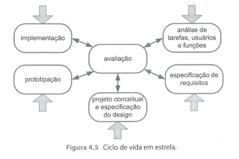
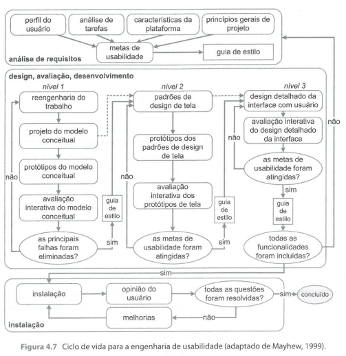

# Processo de Design

## 1. Introdução

O processo de design é fundamental para projetos de Interação Humano-Computador, assegurando interfaces de alta usabilidade. É importante considerar o usuário em todas as etapas do projeto, desde a análise de requisitos até a avaliação de usabilidade, para proporcionar interações eficientes e bem-aceitas.

Este aterfato tem como objetivo de determinar o modelo de design mais adequado ao projeto. Com este fim, certos critérios devem ser observados: tempo, experiência da equipe, os recursos disponíveis e as necessidades do projeto.

## 2. Modelo de Design Avalidados

### 2.1. Modelo Simples

Preece, Sharp e Roges (Preece et al, 2002; Sharp et al, 2007) organizaram o modelo simples de design em IHC. Ele é composto por três etapas: compreensão do contexto, projeto conceitual e prototipagem.

Esse modelo, por sua simplicidade, é indicado para designers experientes e não se adequa bem a estudantes.

### 2.2. Ciclo de Vida Estrela

É um modelo de desenvolvimento de interface humano-computador (IHC) proposto por Hix e Harston em 1993. Este modelo é composto por quatro fases principais, representadas pelas pontas de uma estrela, e tem como objetivo garantir uma abordagem iterativa e centrada no usuário durante o processo de desenvolvimento de sistemas interativos.

No ciclo de vida estrela, o desenvolvimento pode começar por qualquer ponta, seguido da avaliação.

### 2.3. Engenharia de Usuabilidade de Mayhew

É uma abordagem iterativa para um projeto de interfaces humano-computador. Envolve a aplicação de princípios e métodos de engenharia em três etapas principais, conhecidas como o ciclo de vida para engenharia de usabilidade (MAYHEW, 1999):

Análise de requisitos: Nesta etapa, são coletados os requisitos do projeto, dados dos usuários, suas necessidades, assim como as tarefas a serem executadas na interface.

Design, avaliação e desenvolvimento: são criadas soluções com base na análise de requisitos, incluindo modelos conceituais, protótipos e guias de estilo, sempre levando em consideração os teste de usabilidades.

Ao fim desta etapa, espera-se ter um protótipo de alta fidelidade que atenda todas as metas de design e usabilidade.

Instalação: O design deve coletar opiniões dos usuários depois de algum tempo de uso. Essas opiniões serão úteis para melhorar o sistema em versões futuras.

## 3. Conclusão

Em conclusão, o modelo de design mais adequado para o projeto é a Engenharia de Usabilidade de Mayhew. Este modelo é mais detalhado e iterativo, o que o torna benéfico para o aprendizado de designers inexperientes. A Engenharia de Usabilidade de Mayhew fornece uma estrutura clara e passo a passo, guiando os designers ao longo de todas as etapas do processo, desde a análise de requisitos até a instalação. Dessa forma, ela não apenas garante a qualidade da interface (por avaliação contínua), mas também contribui para o desenvolvimento das habilidades e conhecimentos dos designers, tornando-se uma escolha ideal para o projeto em questão.

## 4. Referências
Barbosa, S. D. J., & Silva, B. S. (2010). Interação Humano Computador. Elsevier.

Mayhew, D. J. (1999). The Usability Engineering Lifecycle: A Practitioner's Handbook for User Interface Design. Morgan Kaufmann Publishers.