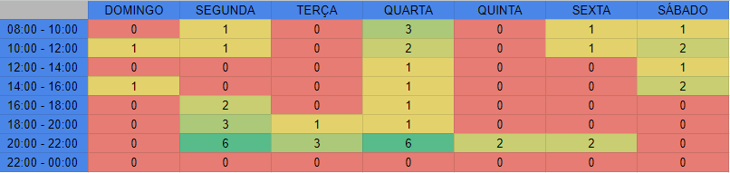

# Reuniões

## Introdução

&emsp;&emsp; Reuniões permitem que os membros da equipe se comuniquem e se atualizem sobre o status do projeto, compartilhem ideias, discutam problemas e tomem decisões importantes. As reuniões também podem ser utilizadas para definir metas e objetivos, estabelecer prioridades, distribuir tarefas, monitorar o progresso do projeto e avaliar o desempenho da equipe. Porém, para que sejam benéficas e úteis, elas devem ser bem planejadas, de forma que o tempo seja usado de maneira produtiva e que os membros da equipe possam participar de forma ativa.
Com o intuito de ter reuniões com todos os membros da equipe, com o auxílio de um mapa de calor preenchido por todos visando os horários de disponibilidade foi possível selecionar os melhores horários para realizar uma reunião em que todos os membros estejam livres para participar ativamente.

<figcaption align="center">Tabela 1 - <a href="https://pt.wikipedia.org/wiki/Mapa_de_calor">Mapa de calor<a> preenchido pela equipe.</figcaption>
  

&emsp;&emsp; Os horários mais vermelhos são os de menor disponibilidade do grupo, e os mais verdes são os em que o grupo possui mais disponibilidade. Sendo assim, por meio de votação, o grupo optou por se reunir na quarta-feira e, se necessário, realizar uma reunião de suporte na segunda-feira.

| Versão | Data  |            Descrição             |     Autor      |    Revisor    |
|:------:|:-----:|:--------------------------------:|:--------------:|:-------------:|
|  1.0   | 21/04 | Adição do mapa de calor | Vitor Borges | Carlos Daniel |
|  1.1   | 23/04 | Aba movida para planejamento     | Vitor Borges | Carlos Daniel | 
|  1.2   | 27/04 | Adiçao de referências            | Vitor Borges | Carlos Daniel |
  
## Referências
> Saiba mais sobre mapas de calor: <https://pt.wikipedia.org/wiki/Mapa_de_calor> Acesso em 27/04
