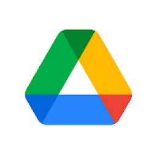

# Projeto Final

## 1. Introdução

## 2. Site Selecionado

## 3. Ciclo de vida utilizado no projeto

## 4. Planejamento dos recursos e entregas 

## 5. Execução do projeto 

## 6. Resultados alcançados 

## 7. Tabela sintetizando ferramentas utilizadas e onde foram utilizadas

|                                            | Ferramenta      | Utilidade                                               | |
|:------------------------------------------:|:---------------:|:-------------------------------------------------------:|
|        | <a href="https://www.google.com/sheets/about/">Google Sheets<a>   | Utilizamos planilhas para definir os horários livres da equipe |
|       | <a href="https://www.microsoft.com/pt-br/microsoft-teams/group-chat-software">Microsoft Teams<a> | Realizamos e gravamos reuniões, entrevistas e apresentações do grupo |
|           | <a href="https://play.google.com/store/apps/details?id=org.telegram.messenger&hl=pt_BR&gl=US">Telegram<a>        | Utilizado para troca de mensagens pontuais e realização de votações    |
|               | <a href="https://github.com/">GitHub<a> | <a href="https://prdm0.github.io/aulas_computacional/versionamento-de-c%C3%B3digo.html">Versionamento do código<a> e hospedagem da wiki do projeto |
|              | <a href="https://code.visualstudio.com/">VS Code<a>         | Edição das páginas da wiki (github pages)                                  |
| | <a href="https://pt.wikipedia.org/wiki/Google_Docs">Google Documents<a>| Edição de documentos de entrega em equipe |
|          | <a href="https://www.google.com/intl/pt-br/drive/about.html">Google Drive<a> | Compartilhamento de arquivos grandes|
|             | <a href="https://pt.wikipedia.org/wiki/YouTube">YouTube<a> | Disponibilização das reuniões, apresentações e entrevistas realizadas pelo grupo|
|| <a href="https://powerbi.microsoft.com/pt-br/">Power BI</a> | Apresentação de dados coletados nos relatos| 
|| <a href="https://www.lucidchart.com/pages/">LucidChart</a> | Criação de fluxogramas para as tarefas analisadas
| | <a href="https://miro.com/pt/">Miro</a> | Criação dos <a href="https://interacao-humano-computador.github.io/2023.1-Agiel/desenvolvimento/storyboard/planejamento_avaliacao_storyboard/">storyboards</a> e <a href="https://interacao-humano-computador.github.io/2023.1-Agiel/desenvolvimento/prot%C3%B3tipo_de_papel/planejamento_da_avalia%C3%A7%C3%A3o_do_prot%C3%B3tipo_de_papel/">protótipos de papel</a> |
|| <a href="https://www.figma.com/">Figma</a>| Elaboração do <a href="https://www.figma.com/proto/uIASKVWfrkY0CpKDNld4wm/Prototipo-Agiel?type=design&node-id=17-26&scaling=min-zoom&page-id=0%3A1&starting-point-node-id=17%3A26">protótipo de alta fidelidade</a> |

<h6 align = "center"> Tabela 2: Ferramentas utilizadas
  Autor: Vitor Borges </h6>

## 8. Tabela sintetizando técnicas (em cada etapa do projeto com o nome do participante que executou a técnica)

## 9. Tabela sintetizando todos os artefatos com autor e revisor

## 10. Tabela sintetizando as avaliações dos protótipos ( com entrevistadores e o número de participantes com os nomes do participantes do grupo que participaram da avaliação)

## 11. Uma tabela sintetizando o método de verificação dos artefatos com autor e revisor (do checklist e da verificação)

## 12. Tabela sintetizando todos os vídeos das apresentações de cada etapa

| Etapa | Vídeo |
|:-----:|:-----:|
| 1     | <a href="https://www.youtube.com/embed/qOyrZM04N0k">Apresentação Etapa 1</a> |
| 2     | <a href="https://www.youtube.com/embed/9JlRSLM8Bm4">Apresentação Etapa 2</a> |
| 3     | <a href="https://www.youtube.com/embed/9FNERJh48LI">Apresentação Etapa 3</a> |
| 4     | <a href="https://www.youtube.com/embed/qT6Tj-M2Odk">Apresentação Etapa 4</a> |
| 5     | <a href="https://www.youtube.com/embed/2ZNzqNc-eK8">Apresentação Etapa 5</a> |
| 6.1   | <a href="https://www.youtube.com/embed/cSoKhyvFGm8">Apresentação Etapa 6.1</a> |
| 6.2   | <a href="https://www.youtube.com/embed/au5ujzZn-zM">Apresentação Etapa 6.2</a> |
| 7     | <a href="https://www.youtube.com/embed/9Yolk2PQ_o4">Apresentação Etapa 7</a> |
| 8     | <a href="https://www.youtube.com/embed/3ePGaADe4jY">Apresentação Etapa 8</a> |
| final | <a href="">Apresentação Final</a>|

<h6 align = "center"> Tabela 8: Apresentações das etapas
 Autor: Vitor Borges</h6>

## Histórico de versão
A Tabela n registra o histórico de versão desse documento.

| Versão | Data       | Descrição                                 | Autor(es)      | Revisor(es)    |
|--------|------------|-------------------------------------------|----------------|----------------|
| `1.0`  | 05/07/2023 | Criação do documento | Ana Beatriz  | Vitor |
| `1.1`  | 05/07/2023 | Adição da tabela com vídeos das apresentações | Vitor | Ana Beatriz |
| `1.2`  | 05/07/2023 | Adição da tabela com as ferramentas utilizadas no projeto | Vitor | Ana Beatriz |

<h6 align = "center"> Tabela n: Histórico de Versões
 Autor(es): Ana Beatriz</h6>