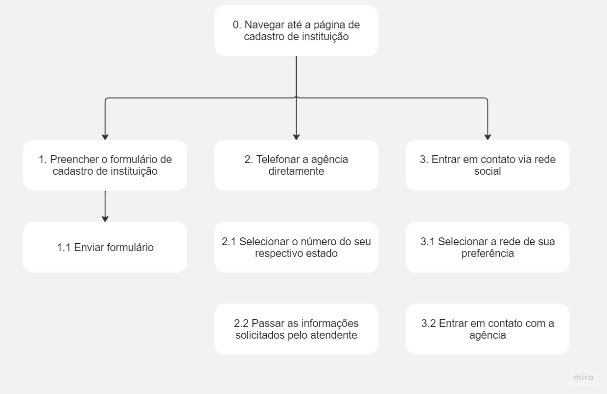

# Análise de Tarefas

## 1. Introdução
<p align="justify">
A análise de tarefas tem como objetivo compreender os trabalhos dos usuários em um sistema, incluindo como são executados e o porquê. Esses trabalhos são definidos em termos dos objetivos das pessoas e organizações envolvidas no software (Diape, 2003).
</p>
<p align="justify">
Este documento tem o fim da apresentar a análise de tarefas do site AGIEL (Agência de Estágios). O artefato produto deve apresentar uma análise concreta e bem detalhada, visto que o site já está operacional, segundo Diaper (2003).
</p>

<p align="justify">
Foram utilizadas duas técnicas distintas para realizar a análise de tarefas do sistema: Análise Hierárquica de
Tarefas (HTA – Hierarchical Task Analysis (Annett, 2003; Annett e Duncan, 1967)) e o GOMS (Goals,
Operators, Methods, and Selection Rules (Kieras, 2004; Card et al., 1983)).
</p>

## 2. Análise Hierárquica de Tarefas (HTA)
<p align="justify">
Essa técnica tem o fim de compreender as competências e habilidade exibidas em tarefas complexas e não repitivas (Annett, 2003; Annett e Duncan,
1967). Nesse contexto, uma tarefa é qualquer parte do trabalho que precisa ser realizado. Por sua vez, uma tarefa pode ser definida em objetivos e subobjetivos através de um processo chamado de decomposição de tarefas. Vale ressaltar que cada subobjetivo é alcançado por uma <b>operação</b>, que é a unidade fundamental em HTA.
</p>

### 2.1 Análise da tarefa: candidatar para uma vaga de estágio

A tarefa "candidatar para uma vaga de estágio" é a principal tarefa que o usuário realiza no sistema, já que é sua funcionalidade principal. A Tabela 1 e a Figura 2 apresentam a análise hierárquica dessa tarefa em sua forma textual e de diagrama, respectivamente.

| Objetivos/Operações                    | Problemas e recomendações                                                                                                                                                                                                                                                                                       |
|----------------------------------------|-----------------------------------------------------------------------------------------------------------------------------------------------------------------------------------------------------------------------------------------------------------------------------------------------------------------|
| 0. Candidatar para uma vaga de estágio | **input**: acesso ao menu "Disponíveis (Meu Curso)" na tela inicial; <br/> **feedback**: tela de vagas, com uma lista sobre vagas relacionadas ao meu curso; <br/> **plano**: escolher vaga de estágio mais adequada ao meu interesse; <br/> **recomendação**: Agrupar as abas para ver os estagios em filtros. |
| 1. Inscrever se na vaga                |                                                                                                                                                                                                                                                                                                                 |
| 2. Confirmar Candidatura               |                                                                                                                                                                                                                                                                                                                 |
| 2.1 Adicionar informações extras       | **input**: colocar informações adicionais caso haja necessidade;                                                                                                                                                                                                                                                |
| 3. Ver minha candidatura               |                                                                                                                                                                                                                                                                                                                 |
<div style="text-align: center">
<p> Tabela 1: Análise Hierárquica de Tarefas para o objetivo "candidatar para uma vaga de estágio" <br/>(Fonte: autor, 2023).</p>
</div>


<div style="text-align: center">
<p> Figura 2: Diagrama da Análise Hierárquica de Tarefas para o objetivo "Candidatar para uma vaga de estágio" <br/> (Fonte: autor, 2023).</p>
</div>

### 2.2 Análise da tarefa: cadastrar instituição de ensino

<p> A tarefa "cadastrar instituição de ensino" é realizada por coordenadores de uma instituição que tenham interesse em vincular a mesmas a agência Agiel.
</p>

| Objetivos/Operações                    | Problemas e recomendações                                                                                                                                                                                                                                                                                       |
|----------------------------------------|-----------------------------------------------------------------------------------------------------------------------------------------------------------------------------------------------------------------------------------------------------------------------------------------------------------------|
| 0. Navegar até a página de cadastro de instituição | Localizar o menu principal; <br/> Passar o mouse sobre a opção "Instituições" no menu; <br/> **input**: Clicar na opção "Cadastrar" |
| 1. Preencher o formulário de cadastro de instituição             | **input**: Preencher dados da instituição (nome, endereço)<br/> **input**: Preencher dados do solicitante (nome, email, telefone)<br/> **input** Adicionar mensagem <br/> **recomendações**: permitir o envio de dois emails ou telefones para contato |
| 1.1. Enviar formulário | **input**: pressionar o botão de envio com as informações já preenchidas|
| 2. Telefonar a agência diretamente | |
| 2.1 Selecionar o número do seu respectivo estado | |
| 2.2 Passar as informações solicitados pelo atendente | |
| 3. Entrar em contato via rede social | |
| 3.1 Selecionar a rede de sua preferência | **input**: escolher uma rede (facebook, twitter, instagram, linkedin ou youtube) para realizar o cadastro atráves de botões; <br/> **recomendação**: apenas divulgar as redes onde o usuário consiga entrar em contato direto com os atendentes (twitter, facebook, linkedin e instagram)|
| 3.2 Entrar em contato com a agência | |

<div style="text-align: center">
<p> Tabela 2: Análise Hierárquica de Tarefas para o objetivo "Cadastrar instituição de ensino" <br/>(Fonte: autor, 2023).</p>
</div>



<div style="text-align: center">
<p> Figura 2: Diagrama da Análise Hierárquica de Tarefas para o objetivo "Candidatar para uma vaga de estágio" <br/> (Fonte: autor, 2023).</p>
</div>

## 3. Objetivos, Operadores, Métodos e Regras de Seleção (GOMS)

<p align="justify">
O GOMS é um procedimento que analisa tarefas e oferece uma descrição do conhecimento necessário para que um usuário possa realizá-las, envolvendo quatros figuras simbólicas: goals, operator, methods e selection rules.
</p>

### 3.1 Análise da tarefa: cadastrar e atualizar currículo.
<p align="justify">
Nessa tarefa, o objetivo do usuário é atualizar seus dados acadêmicos e profissionais, bem como suas qualificações. A partir desse currículo, o usuário poderá concorrer as vagas de estágio.
</p>
<p>Goal 0: Atulizar e cadastrar dados</p>
&emsp;&emsp;- Method 1: Acessar área currículo via menu.
<p>&emsp;&emsp;- SEL RULE (Usuário deve encontrar o botão que leva a sessão de currículo)</p>
<p>&emsp;&emsp;&emsp; OP 1.1: Clicar na sessão de dados acadêmicos.</p>
<p>&emsp;&emsp;&emsp; OP 1.2: Cadastrar dados acadêmicos.</p>
<p>&emsp;&emsp;&emsp; OP 1.3: Clicar no botão de salvar.</p>
<p>&emsp;&emsp;&emsp; OP 1.4: Clicar na sessão de dados pessoais.</p>
<p>&emsp;&emsp;&emsp; OP 1.5: Cadastrar dados pessoais.</p>
<p>&emsp;&emsp;&emsp; OP 1.6: Clicar no botão de salvar.</p>
<p>&emsp;&emsp;&emsp; OP 1.7: Clicar na sessão de dados profissionais.</p>
<p>&emsp;&emsp;&emsp; OP 1.8: Cadastrar dados profissionais.</p>
<p>&emsp;&emsp;&emsp; OP 1.9: Clicar no botão de salvar.</p>
<p>&emsp;&emsp;&emsp; OP 1.10: Clicar na sessão de conhecimentos.</p>
<p>&emsp;&emsp;&emsp; OP 1.11: Informar conhecimentos e qualificações.</p>
<p>&emsp;&emsp;&emsp; OP 1.12: Clicar no botão de salvar.</p>

<p align="justify">
Para a tarefa de atualizar e cadastrar o currículo, o sistema oferece apenas um método de resolução. Tal método apresenta um número muito grande de cliques para mudar de sessão e salvar, tornando a realização da tarefa demorada e  repetitiva.
Uma alternativa para isso seria um procedimento de salvamento automático e utilizar uma página única para realizar a atualização do currículo.
</p>

## 4. Bibliografia
```
BARBOSA, Simone; DINIZ, Bruno. Interação Humano-Computador. Editora Elsevier, Rio de Janeiro, 2010.
```

## Histórico de Versão

| Versão |    Data    |      Descrição       |   Autor(es)    | Revisor(es) |
|:------:|:----------:|:--------------------:|:--------------:|:-----------:|
|  1.0   | 08/05/2023 | Criação do documento | Carlos e Bruno |    Vitor    |
|  2.0   | 20/05/2023 | Adição de nova tarefa | Vitor | |


