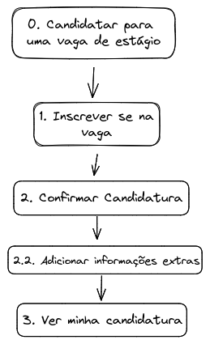
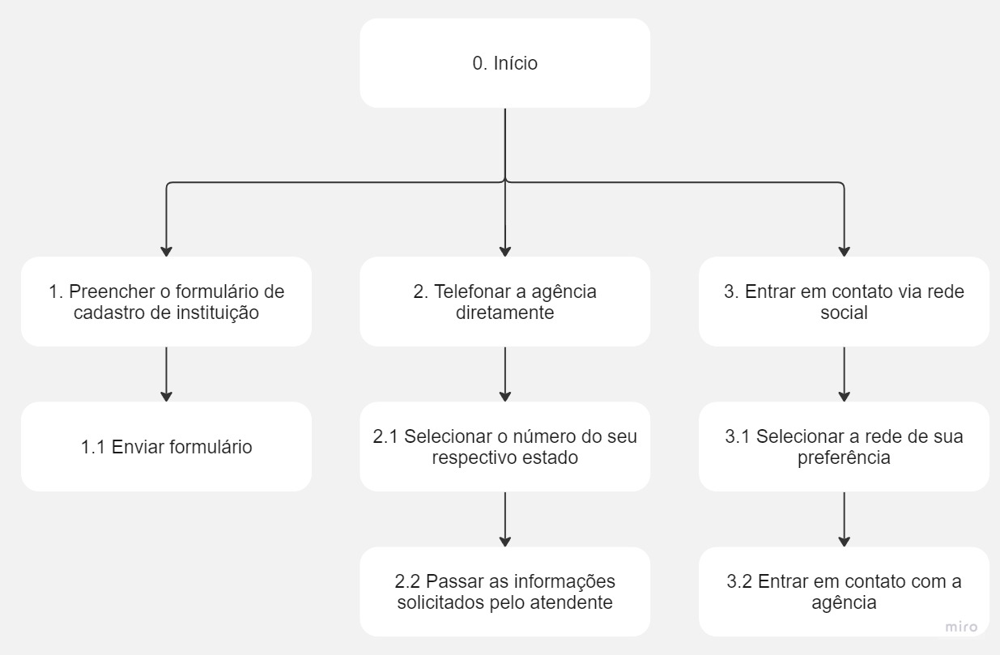

# ***Análise de Tarefas***

## **1. Introdução**

&emsp;&emsp;A análise de tarefas tem como objetivo <b>compreender os trabalhos</b> dos usuários em um sistema, incluindo como são executados e o porquê. Esses trabalhos são definidos em termos dos objetivos das pessoas e organizações envolvidas no software (Diape, 2003).

## **2. Objetivos**

&emsp;&emsp;Este documento tem o fim da apresentar a <b>análise de tarefas do site AGIEL (Agência de Estágios)</b>. O artefato produto deve apresentar uma análise <b>concreta e bem detalhada</b>, visto que o site já está operacional, segundo Diaper (2003).

## **3. Metodologia**

&emsp;&emsp;Foram utilizadas duas técnicas distintas para realizar a análise de tarefas do sistema: <b>Análise Hierárquica de
Tarefas</b> (HTA – Hierarchical Task Analysis (Annett, 2003; Annett e Duncan, 1967)) e o <b>GOMS</b> (Goals,
Operators, Methods, and Selection Rules (Kieras, 2004; Card et al., 1983)).

## **4. Análise Hierárquica de Tarefas (HTA)**

&emsp;&emsp;Essa técnica tem o fim de compreender as competências e habilidade exibidas em tarefas complexas e não repitivas (Annett, 2003; Annett e Duncan,
1967). Nesse contexto, uma tarefa é qualquer parte do trabalho que precisa ser realizado. Por sua vez, uma tarefa pode ser definida em objetivos e subobjetivos através de um processo chamado de decomposição de tarefas. Vale ressaltar que cada subobjetivo é alcançado por uma <b>operação</b>, que é a unidade fundamental em HTA.

### **4.1 Análise da Tarefa: candidatar para uma vaga de estágio**

&emsp;&emsp;A tarefa "candidatar para uma vaga de estágio" é a principal tarefa que o usuário realiza no sistema, já que é sua funcionalidade principal. A Tabela 1 e a Figura 2 apresentam a análise hierárquica dessa tarefa em sua forma textual e de diagrama, respectivamente.

| Objetivos/Operações                    | Problemas e recomendações                                                                                                                                                                                                                                                                                       |
|----------------------------------------|-----------------------------------------------------------------------------------------------------------------------------------------------------------------------------------------------------------------------------------------------------------------------------------------------------------------|
| 0. Candidatar para uma vaga de estágio | **input**: acesso ao menu "Disponíveis (Meu Curso)" na tela inicial;   **feedback**: tela de vagas, com uma lista sobre vagas relacionadas ao meu curso;   **plano**: escolher vaga de estágio mais adequada ao meu interesse;   **recomendação**: Agrupar as abas para ver os estagios em filtros. |
| 1. Inscrever se na vaga                |                                                                                                                                                                                                                                                                                                                 |
| 2. Confirmar Candidatura               |                                                                                                                                                                                                                                                                                                                 |
| 2.1 Adicionar informações extras       | **input**: colocar informações adicionais caso haja necessidade;                                                                                                                                                                                                                                                |
| 3. Ver minha candidatura               |                                                                                                                                                                                                                                                                                                                 |

 Tabela 1: Análise Hierárquica de Tarefas para o objetivo "candidatar para uma vaga de estágio"  (Fonte: Autor, 2023).

 Figura 2: Diagrama da Análise Hierárquica de Tarefas para o objetivo "Candidatar para uma vaga de estágio"   (Fonte: Autor, 2023).

### **4.2 Análise da Tarefa: cadastrar instituição de ensino**

&emsp;&emsp;A tarefa "cadastrar instituição de ensino" é realizada por coordenadores de uma instituição que tenham interesse em vincular a mesma a agência Agiel por meio de um convênio entre a instituição e a agência.

| Objetivos/Operações                    | Problemas e recomendações                                                                                                                                                                                                                                                                                       |
|----------------------------------------|-----------------------------------------------------------------------------------------------------------------------------------------------------------------------------------------------------------------------------------------------------------------------------------------------------------------|
| 0. Preencher o formulário de cadastro de instituição             | **input**: Preencher dados da instituição (nome, endereço)  **input**: Preencher dados do solicitante (nome, email, telefone)  **input** Adicionar mensagem   **recomendações**: permitir o envio de dois emails ou telefones para contato |
| 0.1. Enviar formulário | |
| 2. Telefonar a agência diretamente | |
| 2.1 Passar as informações solicitadas | |
| 3. Entrar em contato com a agência via rede social por sua escolha | **input**: escolher uma rede (Facebook, Twitter, Instagram, Linkedin ou Youtube) para realizar o cadastro atráves de botões;
**recomendação**: apenas divulgar as redes onde o usuário consiga entrar em contato direto com os atendentes (Twitter, Facebook, Linkedin e Instagram) |

 Tabela 2: Análise Hierárquica de Tarefas para o objetivo "Cadastrar instituição de ensino"  (Fonte: Autor, 2023).

 Figura 2: Diagrama da Análise Hierárquica de Tarefas para o objetivo "Candidatar para uma vaga de estágio"   (Fonte: Autor, 2023).

## **5. Objetivos, Operadores, Métodos e Regras de Seleção (GOMS)**

&emsp;&emsp;O GOMS é um procedimento que <b>analisa tarefas</b> e oferece uma descrição do conhecimento necessário para que um usuário possa realizá-las, envolvendo quatros figuras simbólicas: <b>goals</b>, <b>operator</b>, <b>methods</b> e <b>selection rules</b>.

### **5.1 Análise da tarefa: cadastrar e atualizar currículo**

&emsp;&emsp;Nessa tarefa, o objetivo do usuário é atualizar seus dados acadêmicos e profissionais, bem como suas qualificações. A partir desse currículo, o usuário poderá concorrer as vagas de estágio.

Goal 0: Atulizar e cadastrar dados

&emsp;&emsp;&emsp; OP 1.1: Cadastrar dados acadêmicos.

&emsp;&emsp;&emsp; OP 1.2: Cadastrar dados pessoais.

&emsp;&emsp;&emsp; OP 1.3: Cadastrar dados profissionais.

&emsp;&emsp;&emsp; OP 1.4: Informar conhecimentos e qualificações.

&emsp;&emsp;&emsp; OP 1.5: Salvar as informações.

### **5.2 Análise da Tarefa: Inscrição em processo seletivo**

&emsp;&emsp;Nessa tarefa, o objetivo do usuário é realizar a inscrição em um processo seletivo de sua escolha.

Goal 0: Se inscrever em um processo seletivo

&emsp;&emsp;&emsp; OP 1.1: Visualizar os processos seletivos disponíveis.

&emsp;&emsp;&emsp; OP 1.2: Ler as informações do processo seletivo (descrição, requisitos, cronograma, etapas).

&emsp;&emsp;&emsp; OP 1.3: Anexar o currículo.

&emsp;&emsp;&emsp; OP 1.4: Enviar candidatura.

### **5.3 Análise da Tarefa: Obter dicas sobre a gestão de carreira**

&emsp;&emsp;Nessa tarefa, o objetivo do usuário é obter dicas que o auxiliem a traçar objetivos para sua carreira.

Goal 0: Obter dicas sobre gestão de carreira

&emsp;&emsp;&emsp; OP 1.1: Realizar busca do conteúdo desejado.

&emsp;&emsp;&emsp; OP 1.2: Visualizar os artigos apresentados.

&emsp;&emsp;&emsp; OP 1.3: Ler o artigo completo

## **Histórico de Versão**

&emsp;&emsp;A Tabela 3 registra o histórico de versão desse documento.

| Versão |    Data    |      Descrição       |   Autor(es)    | Revisor(es) |
|:------:|:----------:|:--------------------:|:--------------:|:-----------:|
| `1.0`  | 08/05/2023 | Criação do documento | Carlos e Bruno |    Vitor    |
| `2.0`  | 20/05/2023 | Adição de nova tarefa | Vitor | Breno |
| `2.1`  | 22/05/2023 | Adição de nova tarefa | Vitor | Breno |

<h6 align = "center"> Tabela 3: Histórico de Versão
  Autor:  Carlos e Bruno </h6>

## **Bibliografia**

> BARBOSA, Simone; DINIZ, Bruno. Interação Humano-Computador. Editora Elsevier, Rio de Janeiro, 2010.
