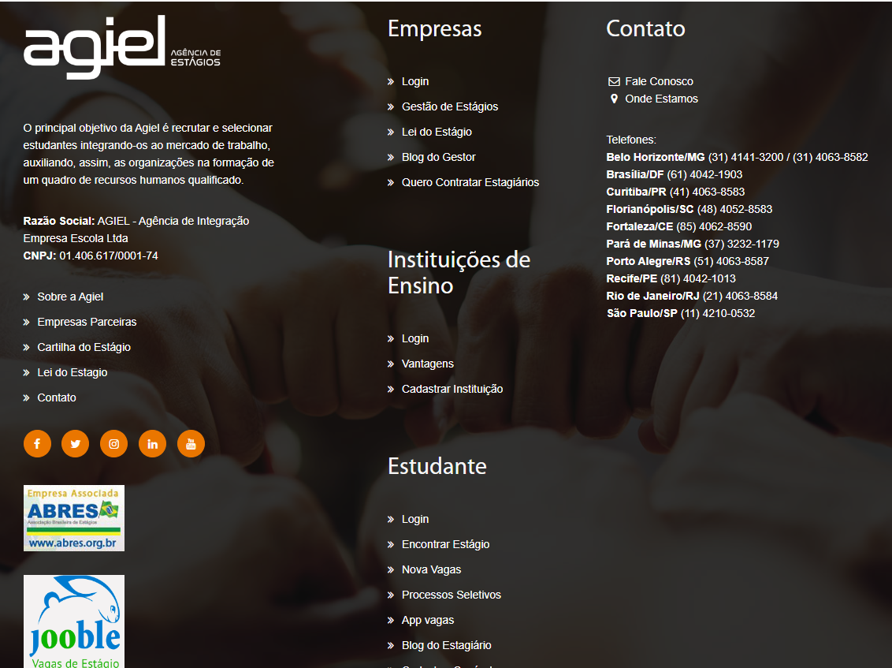
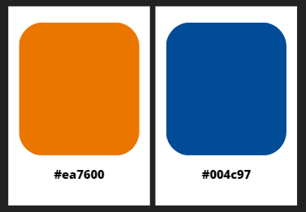

# Guia de Estilo

## 1. Introdução

O guia de estilo é um conjunto de diretrizes para a comunicação escrita e visual de uma empresa ou organização. É uma ferramenta importante para garantir que todas as comunicações de uma empresa sejam coesas e reflitam sua identidade de marca. Ele ajuda a garantir que a comunicação da empresa seja clara, profissional e fácil de entender, independentemente do público-alvo ou do meio de comunicação utilizado. Além disso, o guia de estilo pode ajudar a manter a consistência na comunicação de uma empresa ao longo do tempo, mesmo que haja mudanças na equipe ou na estratégia de negócios.

## 2. Objetivo

O objetivo desse guia é apresentar elementos que ajudam a definir a identidade e visual do site da Agiel.

## 3. Organização

1. Introdução (com Objetivo do guia de estilo, Organização e conteúdo do guia de estilo, Público alvo do guia de estilos (programadores, gerentes, equipe de suporte), Como utilizar o guia (em produção e manutenção), Como manter o guia)
2. Resultados de análise • Descrição do ambiente de trabalho do usuário
3. Elementos de interface • Disposição espacial e grid • Janelas • Tipografia • Cores
4. Elementos de interação - • Estilos de interação • Seleção de um estilo • Aceleradores (teclas de atalho)
5. Elementos de ação • Preenchimento de campos • SeleçãO • Ativação
6. Vocabulário e padrões • Terminologia • Tipos de tela (para tarefas comuns) • Sequências de diálogos (e.g., para feedback ou confirmação de uma operação)

### 3.1 Público alvo

O público-alvo do guia de estilo depende da organização ou empresa em questão e de como ela deseja utilizar o guia. Em geral, o guia de estilo é direcionado a todos os membros da equipe que participam da criação de materiais de comunicação, como escritores, designers, editores, desenvolvedores e gerentes de projeto. Também pode ser útil para membros da equipe de suporte, que podem precisar fornecer orientações de comunicação aos clientes.

Nesse projeto, como é um Guia de Etilo feito por estudantes de software, o público-alvo seria principalmente outros desenvolvedores e programadores, bem como gerentes de projeto e equipes de suporte que trabalham no desenvolvimento de software.

### 3.2 Como utilizar o guia

Para utilizar o guia de estilo em produção e manutenção, é importante aplicar as diretrizes a todos os novos materiais, revisitar o guia periodicamente, integrá-lo às ferramentas de desenvolvimento e treinar a equipe. Isso garante a consistência e a qualidade das comunicações da empresa ou do desenvolvimento de software, melhorando a experiência do usuário e fortalecendo a identidade da marca.

### 3.3 Como manter o guia

Para manter o guia de estilo atualizado, é necessário fazer revisões periódicas, solicitar feedback dos usuários, adaptá-lo às novas tecnologias, documentar as decisões tomadas, e comunicar as atualizações para toda a equipe envolvida na produção de comunicações ou desenvolvimento de software. Ao manter o guia de estilo atualizado, a equipe pode garantir que as diretrizes e as melhores práticas reflitam a evolução da empresa e da tecnologia, melhorando a qualidade do desenvolvimento de software e a experiência do usuário.

## 4. Resultados de análise
### 4.1 Descrição do ambiente de trabalho do usuário
Em geral, o ambiente de trabalho do usuário no site da Agiel é projetado para tornar o processo de busca e candidatura a vagas de estágio o mais fácil e eficiente possível, fornecendo acesso a um grande número de vagas e recursos úteis.

Uma vez que o usuário encontre uma vaga de interesse, ele pode ler a descrição completa da vaga, que geralmente inclui informações sobre a empresa, requisitos específicos, responsabilidades e benefícios. O usuário também pode enviar sua candidatura diretamente pelo site.

## 5. Elementos de interface
### 5.1 Disposição espacial e grid
A interface do site é dividida em três áreas principais. A parte superior, mostrada na figura 1, apresenta um menu de opções de como o usúario quer fazer o login. 

Na parte inferior mostra conteúdos do site como Blog do Gestor (Figura 2), Processos Seletivos, Novas Vagas e Blog do Estagiário.

Na Figura 3 vemos o rodapé onde contém as informações de contado 

 Figura 1: Captura de tela do site Agiel  (Fonte: autor, 2023).

 Figura 2: Captura de tela do site Agiel  (Fonte: autor, 2023).

 Figura 3: Captura de tela do site Agiel  (Fonte: autor, 2023).

### 5.2 Janelas

O site possui diversas janelas que permitem a interação entre as empresas, as instituições de ensino e os estudantes. Dentre essas janelas, destacam-se a Gestão de Estágios (figura 4), utilizada pelas empresas para gerenciar seus programas de estágio; o Convênio com Instituição de Ensino(figura 5), utilizada pelas faculdades para se cadastrarem e gerenciarem as informações dos seus alunos; e a janela de Vagas Disponíveis(figura 6), utilizada pelos estudantes para buscar e se candidatar às oportunidades de estágio disponíveis no site. Cada uma dessas janelas é projetada para atender às necessidades específicas dos diferentes públicos-alvo do site.

 Figura 4: Captura de tela da janela Gestão de Estágios do site Agiel  (Fonte: autor, 2023).

 Figura 5: Captura de tela da janela Convênio com Instituição de Ensino do site Agiel  (Fonte: autor, 2023).

 Figura 6: Captura de tela da janela Vagas Disponíveis do site Agiel  (Fonte: autor, 2023).

### 5.3 Tipografia
O site utiliza uma combinação de fontes para garantir uma boa legibilidade e experiência visual para o usuário. A fonte "Myriad Pro" é usada em títulos e cabeçalhos, enquanto "Raleway" é utilizada para textos corridos e informações mais detalhadas. Além disso, para dar destaque e variação, é usado "Open Sans" em alguns elementos do site. Essa combinação de fontes, junto com um layout organizado e cores bem definidas, contribui para a identidade visual do site e para a fácil navegação do usuário.

### 5.4 Cores

O site tem como cores principais o #ea7600 e o #004c97 como pode ver na figura 7. O primeiro é um tom de laranja que transmite energia e entusiasmo, enquanto o segundo é um azul escuro e forte. Essas cores são usadas em vários elementos do site, como botões, links e cabeçalhos, e ajudam a criar um visual moderno e vibrante. Além disso, a combinação dessas cores é bastante atraente aos olhos e pode ajudar a destacar informações importantes ou chamadas à ação no site.

 Figura 7: Cores principais do site  (Fonte: autor, 2023).

## 6. Elementos de interação 
### 6.1 Estilos de interação 
Os usuários interagem com o site por meio de botões, formulários e ícones.

### 6.2 Seleção de um estilo 
O site tem um estilo mais minimalista nos botões e menus, mas tem muitas imagens e pode ser um pouco poluído.

### 6.3 Aceleradores
O site possui 3 menus suspenso para as abas principais, são eles:

EMPRESAS:

* Login
* Gestão de Estágios
* Lei do Estágio
* Blog do Gestor

INTITUIÇÕES DE ENSINO:

* Login
* Vantagens

ESTUDANTES:

* Login
* Encontrar Estágio
* Nova Vagas
* Processos Seletivos
* App vagas
* Blog do Estagiário

## 6. Elementos de ação 
### 6.1 Preenchimento de campos 
Os elementos de preenchimento de campos ocorre em todos os menus citados acima, pois o site necessita de login e cadastrar algumas informações.
### 6.2 Seleção 
Os elementos de seleção ocorrem quando o estudande escolher uma vaga.
### 6.3 Ativação
A ativação é inclui botões, links e ícones.

## 7. Vocabulário e padrões 
### 7.1 Terminologia 
O site emprega termos relacionados a vagas de estágio e utiliza um vocabulário comum para facilitar o entendimento dos usuários que acessam a plataforma.

### 7.2 Tipos de tela
As telas do site apresentam um padrão simples e uniforme, com exceção da tela principal que contém muitas informações. A identidade visual é mantida em todas as telas, proporcionando uma experiência coesa e consistente ao usuário.

### 7.3 Sequências de diálogos
As sequências do site são consistentes e seguem um padrão, permitindo que o usuário se familiarize com o processo de navegação. Além disso, os botões de confirmação e cancelamento são semelhantes em todas as páginas, facilitando a compreensão e ações do usuário.

## Histórico de Versão
A Tabela 1 registra o histórico de versão desse documento.

| Versão |    Data    |      Descrição       |   Autor(es)    | Revisor(es) |
|:------:|:----------:|:--------------------:|:--------------:|:-----------:|
| `1.0`  | 15/05/2023 | Criação do documento e da Introdução| Ana Beatriz |    Breno   |
| `1.1`  | 15/05/2023 | Adicionando o resultado de analise e elementos de interface | Ana Beatriz |    Breno   |
| `1.2`  | 15/05/2023 | Adicionando elementos de interação, ação e vocabulário  | Ana Beatriz |    Breno   |

<h6 align = "center"> Tabela 1: Histórico de Versões
  Autor: Ana Beatriz </h6>

## Bibliografia

>Barbosa, S. D. J.; Silva, B. S. da; Silveira, M. S.; Gasparini, I.; Darin, T.; Barbosa, G. D. J. (2021)
Interação Humano-Computador e Experiência do usuário. Autopublicação. ISBN: 978-65-00-19677

>Curso: FGA0173 - INTERAÇÃO HUMANO COMPUTADOR - 2023/1. Disponível em: <https://aprender3.unb.br/course/view.php?id=18552>
