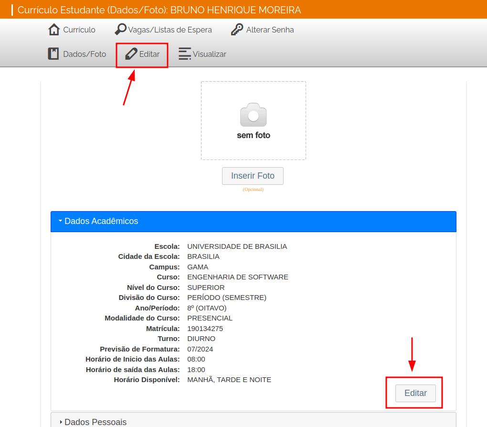

# Princípios Gerais do Projeto

## 1. Introdução

Os princípios gerais do projeto de interface do usuário são diretrizes fundamentais que os designers seguem para criar interfaces eficazes, intuitivas e agradáveis para os usuários. Esses princípios visam melhorar a usabilidade e a experiência do usuário, garantindo que a interação com um sistema ou aplicativo seja fácil, eficiente e satisfatória.

Alguns dos princípios gerais comuns incluem a encontrabilidade, que diz respeito à capacidade do usuário de encontrar facilmente as informações desejadas; o projeto para erros, que envolve a previsão e a recuperação de erros por parte do usuário; a visibilidade e o reconhecimento, que se referem à apresentação clara de ações, objetos e opções para os usuários; a simplicidade, que preconiza a simplificação das tarefas complexas, dividindo-as em etapas menores e mais gerenciáveis; e a padronização, que busca manter uma interface consistente e familiar para os usuários.

## 2. Princípios Gerais

- **Encontrabilidade**: O usuário deve ser capaz de encontrar facilmente as informações que precisa no site, seja através de uma pesquisa eficiente ou de uma navegação clara e intuitiva.

- **Projetar para erros**: É importante antecipar que os usuários podem cometer erros e fornecer mecanismos para que eles possam se recuperar facilmente. Isso inclui mensagens de erro claras e informativas, opções de desfazer ações e a capacidade de corrigir erros sem perder o trabalho realizado.

- **Visibilidade e Reconhecimento**: O sistema deve fornecer feedback visual e informativo para o usuário, indicando o que está acontecendo e fornecendo pistas claras sobre como prosseguir. As ações, objetos e opções devem ser claramente visíveis e facilmente reconhecíveis.

- **Simplicidade**: É recomendado simplificar as tarefas e reduzir a carga cognitiva exigida do usuário. Isso pode ser feito através da divisão de tarefas complexas em etapas menores e mais gerenciáveis, evitando a necessidade de planejamento excessivo e resolução de problemas.

- **Padronização**: Manter uma interface consistente e padronizada é fundamental para criar uma experiência de usuário coesa e intuitiva. O uso de elementos de design consistentes, como cores, ícones, layouts e terminologia, ajuda os usuários a se sentirem familiarizados e confortáveis ao utilizar o sistema.

## Principios Gerais aplicado ao projeto Agiel

-  **Visibilidade e Reconhecimento**: Ao entrar dentro da plataforma como estudante, é possível notar alguns botões e um deles é o "Editar", porém o sistema não deixa claro qual a real função deste botão, não deixa explicíto o que o usuário vai editar. Isto pode causar confusão na navegação e nos objetivos do usuário. Sendo que logo abaixo, ao clicar em alguma aba de informação, temos outro botão de editar também.

 Figura 1:  Botões de editar espalhados  (Fonte: autor, 2023).

- **Encontrabilidade**: É possível notar que tem uma certa dificuldade para acessar as canditaturas para usuários que não estejam acostumados com a plataforma, pois, para acessar essa informação é necessário ir em "Vagas/Lista de Espera" para então achar o botão de "Canditaturas".

 Figura 2:  Botões de editar espalhados  (Fonte: autor, 2023).

## **Histórico de Versão**
A Tabela 1 registra o histórico de versão desse documento.

| Versão |    Data    |      Descrição       | Autor(es) |  Revisor(es)   |
|:------:|:----------:|:--------------------:|:---------:|:--------------:|
| `1.0`  | 08/05/2023 | Criação do documento |   Bruno   | Pedro Siqueira |

<h6 align = "center"> Tabela 1: Histórico de Versão
  Autor: Bruno </h6>

## Bibliografia

> BARBOSA, Simone; DINIZ, Bruno. Interação Humano-Computador. Editora Elsevier, Rio de Janeiro, 2010.
